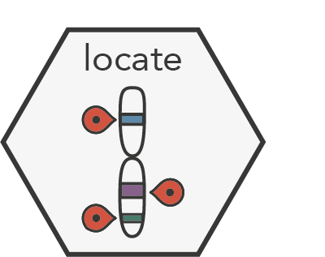

# locate </a>
A package for segmenting long-reads sequencing data and inferring copy number states.


## Installation

```bash
$ pip install locate
```

## Usage

- TODO

## Contributing

Interested in contributing? Check out the contributing guidelines. Please note that this project is released with a Code of Conduct. By contributing to this project, you agree to abide by its terms.

## License

`locate` was created by Lucrezia Valeriani. It is licensed under the terms of the MIT license.

## Credits

`locate` was created with [`cookiecutter`](https://cookiecutter.readthedocs.io/en/latest/) and the `py-pkgs-cookiecutter` [template](https://github.com/py-pkgs/py-pkgs-cookiecutter).
